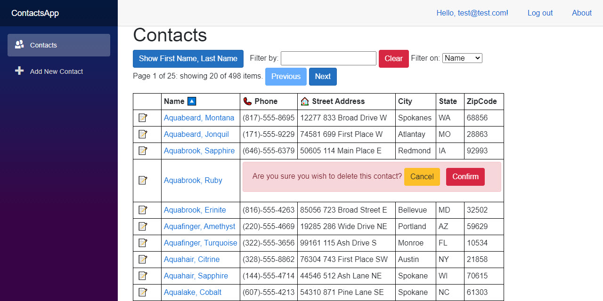

# BlazorWasmEFCoreExample

Example of a Blazor WebAssembly project that uses Entity Framework Core on the server for data access.

> **Blog post is coming**

## Features

* Application hosted authentication and registration
* Extended identity features to audit user creation, modification, email confirmation, and deletion
* Entity Framework Core
* Multiple data contexts
* Entity Framework Core logging
* Shadow properties: the database tracks row version, the user who created the entity and timestamp, and the user who last modified the entity and timestamp, without having to define these properties on the C# domain class
* Automatic audit that tracks changes with a before/after snapshot and is generated at the data context level
* Optimistic concurrency with delta resolution (when the database changes, the UI shows the changes so the user can overwrite or abort)
* Entity validation on the client and server using data annotations
* A grid that features paging, sorting, and filtering with debounce (i.e. typing three characters will result in just one database round trip)
* Dynamic filtering and sorting with serverside evaluation
* 99% of the UI is contained in a Razor class library that is usable from both Blazor WebAssembly and Blazor Server applications
* Example of the repository pattern: the client and server use the same interface with a different implementation
* Use of `IHttpClientFactory` to create a custom client with an authorization message handler

## Quick start

1. Optionally fork the repository.
1. Clone the repository (or your fork): 

   `git clone https://github.com/jeremylikness/BlazorWasmEFCoreExample.git`
1. If you don't have `localdb` installed, update `appsettings.json` and `appsettings.Development.json` in the `ContactsApp.Server` project to point to a valid database instance. 
1. The `DefaultConnection` is used for identity and can have any database name.
1. The `blazorcontactsdb` is used for the application database and must match `ContactContext.BlazorContactsDb` in the `ContactsApp.DataAccess` project (the default value is `blazorcontactsdb`).

### Visual Studio

1. Open the solution file.
1. Ensure the `ContactsApp.Server` project is set as the start up project.
1. Open the `NuGet Package Manager -> Package Manager Console`. 
1. In the console, with the server project selected, type:

    `update-database -Context ApplicationAuditDbContext`
1. You are ready to launch the application.

See note at the end of the next section.

### Visual Studio Code

1. Navigate to the `ContactsApp/Server` folder.
1. If you haven't installed the EF Core Command Line Interface (CLI), install it by following [these instructions](https://docs.microsoft.com/ef/core/miscellaneous/cli/dotnet). Choose the latest stable version (the project file currently ships with version 3.1.4).
1. Run 

    `dotnet ef database update --context ApplicationAuditDbContext` 
    
    to set up the identity database.
1. Type 

   `dotnet run`
    
   to start the server. Navigate to the port specified.
  
> **Note**: the demo app is designed to create and populate the contacts database the first time you open the web page. This may result in a delay and from Visual Studio can throw a timeout excpetion. This is normal and is just used to make setup easier. Subsequent runs should load immediately.

Submit any feedback, questions, suggestions, or issues [here](https://github.com/JeremyLikness/BlazorWasmEFCoreExample/issues/new).

Regards,

[@JeremyLikness](https://twitter.com/JeremyLikness)
